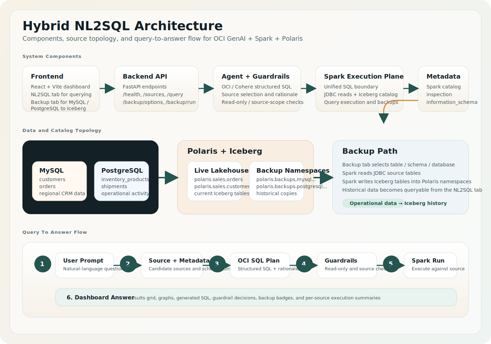

# Architecture Notes

The diagram above summarizes two things:

- the core Hybrid NL2SQL components across frontend, backend, agent, Spark, Polaris, and operational sources
- the end-to-end query-to-answer flow, including the backup-to-Iceberg path that publishes historical tables into `polaris.backups.*`

## Design Goals

- Use Spark as the common execution plane for heterogeneous data access.
- Use Polaris for Iceberg catalog access instead of modeling relational systems as Polaris-native sources.
- Keep the LLM focused on planning and SQL synthesis, not credential handling or unrestricted execution.
- Make the app safe-by-default with read-only SQL checks and explicit row limits.

## Logical Components

### Frontend

- Single-page web app with a chat-style query panel
- Includes a second `Backup To Iceberg` tab for materializing MySQL or PostgreSQL data into Polaris-managed Iceberg tables
- Displays:
  - user question
  - selected source strategy
  - generated SQL
  - guardrail decisions
  - returned rows
  - dashboard graphs and backup-state cues such as Polaris backup badges

### Backend API

- `POST /api/v1/query` accepts natural-language questions
- `GET /api/v1/health` reports application readiness
- `GET /api/v1/sources` returns configured sources and sample metadata
- `GET /api/v1/backup/options` discovers backup-eligible MySQL and PostgreSQL tables
- `POST /api/v1/backup/run` copies selected source data into Iceberg tables surfaced through Polaris

### Agent Layer

- Builds a schema-aware system prompt
- Selects one or more candidate sources
- Produces SQL in a structured response
- Falls back to a deterministic stub mode when OCI is not configured
- Uses live Polaris, PostgreSQL, and MySQL metadata when Spark connectivity is available

### Execution Layer

- Creates a Spark session with Iceberg and Polaris-compatible catalog settings
- Provides extension points for:
  - Polaris catalog access via Iceberg REST catalog
  - JDBC-backed MySQL views
  - JDBC-backed PostgreSQL views
  - JDBC-backed Oracle views
- When Polaris is enabled, Spark receives the common Iceberg REST catalog properties used by Polaris deployments, including `warehouse`, `scope`, OAuth `credential` or bearer `token`, `header.X-Iceberg-Access-Delegation`, and optional extra catalog properties from `POLARIS_CATALOG_OPTIONS`
- The same Spark layer also performs JDBC-to-Iceberg backup materialization for the backup workflow

### Metadata Layer

- Polaris metadata is discovered through Spark catalog inspection:
  - `SHOW NAMESPACES`
  - `SHOW TABLES`
  - `DESCRIBE TABLE`
- PostgreSQL and MySQL metadata are discovered through Spark JDBC queries against:
  - `information_schema.tables`
  - `information_schema.columns`
- A bundled sample catalog remains as a fallback when live systems are unavailable
- Backup tables under `polaris.backups.*` are surfaced as Polaris metadata so the NL2SQL agent can reason over historical copies

## Query To Answer Flow

1. A user submits a prompt from the `NL2SQL Dashboard`.
2. The backend resolves candidate sources and pulls live metadata where available.
3. The agent builds a schema-aware OCI prompt and requests structured SQL.
4. Guardrails verify that the SQL is read-only, bounded, and scoped to the declared source.
5. Spark executes the approved SQL against Polaris or JDBC-connected operational systems.
6. The frontend renders the answer as dashboard cards, graphs, generated SQL, and per-source result tables.

## Backup To Iceberg Flow

1. A user opens the `Backup To Iceberg` tab.
2. The backend discovers eligible MySQL or PostgreSQL tables through Spark JDBC metadata inspection.
3. The user selects a table, schema, or whole database and chooses a destination namespace.
4. Spark reads the operational source through JDBC.
5. Spark writes the copied data into Iceberg tables inside Polaris namespaces such as `polaris.backups.postgresql...`.
6. Those backup tables become available to later NL2SQL prompts as historical Polaris data.

## Recommended Production Enhancements

- Persist query traces and execution metrics
- Add semantic schema descriptions from your data catalog
- Introduce SQL linting and allowlists per source
- Add async job execution for large queries
- Add SSO and per-user authorization

## Source Strategy

- `polaris`: preferred for Iceberg tables surfaced through the Polaris REST catalog
- `mysql`: accessed through Spark JDBC readers or curated Spark views
- `postgresql`: accessed through Spark JDBC readers or curated Spark views
- `oracle`: accessed through Spark JDBC readers or curated Spark views

## Guardrail Strategy

- allow only read-only statements
- block DDL and DML keywords
- enforce `LIMIT`
- return generated SQL before execution so the UI can support approvals later
